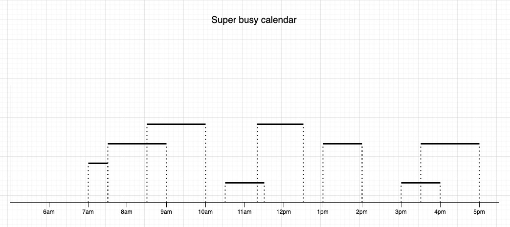
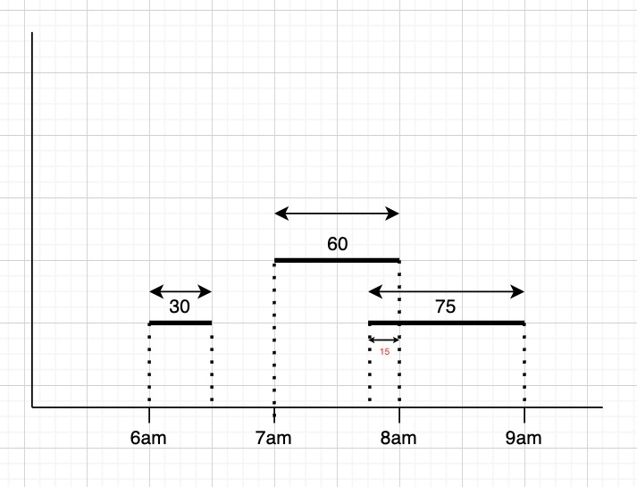

# Part 3: Nick is very busy

## What's the problem?

Every day Nick's calendar is filled with hundreds of meetings, some of these meetings overlap with others meaning Nick is _often_ late to the start of some of his meetings.



## The Task

Nick has provided you with a list of his meetings, you must calculate the total amount of time that Nick _actually_ spends in meetings for the given list.

### Example

Consider Nick gives you the following list of meetings:

```python
meetings = [
	(6, 6.5),
	(7, 8),
	(7.75, 9)
]
```

This list represents meetings from...

1. 6am - 6:30am
2. 7am - 8am
3. 7:45am - 9am

Note: The decimal notation (7.75 means 7 and 3/4 of an hour, i.e 7:45)

A visual representation of these meetings is shown below...



- The total time of all the meetings is (30 + 60 + 75) = 165 minutes
- However, the last two meetings overlap by 15 minutes
- So the total time Nick will spend in meetings is (165 - 15) = 150 minutes

### Format

- Given a list of Nick's meeting in the form `[(x0, x1), ...]` return the total time he will spend in meetings

### Notes

- The number of meetings can range from 0 onwards :)
- For simplicity meeting times are on a linear scale. i.e you don't need to worry about different days starting and ending
  - All x values range from at least 0 onwards
  - Don't worry about am or pm labels, each pair of x0 and x1 are either integers or float i.e `[(6, 6.5), (14, 15.25)]`
- For each pair x0 will always be smaller than x1 (x0 < x1)
- Nick has a lot of meetings so he may have more than 2 meetings overlapping at a time, he could have hundreds!
- For simplicity meetings only start and finish in 15 minute intervals...
  - 9 - Would represent 9am
  - 9.25 -> 9:15
  - 9.5 -> 9:30
  - 9.75 -> 9:45
  - You will **never** get a time outside these boundaries like 9.007
  

